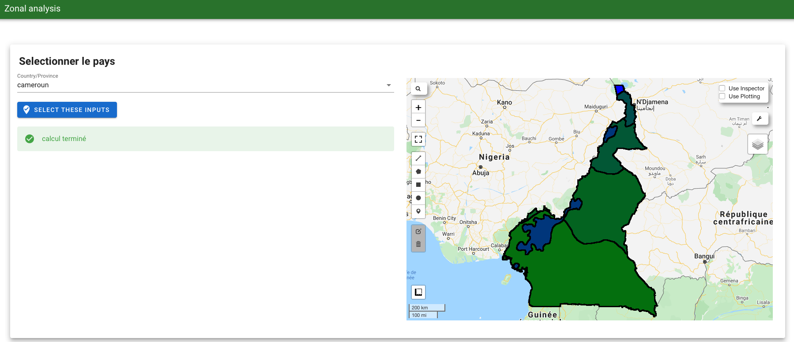
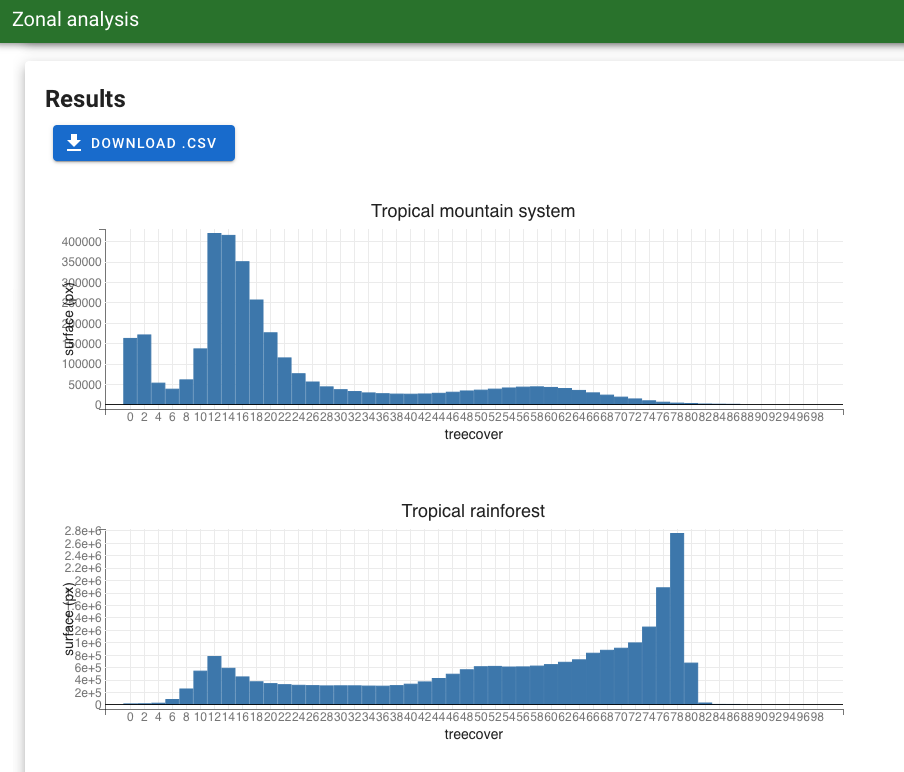

# zonal-analysis

## About

Permet de réaliser l'analyse zonale d'un pays membre de la liste fournie par le CIRAD. 

Réalise l'analyse zonale des données GFCC 2010 sur les écozones de la FAO de 2010. 

Les resultats obtenus sont présentés sous la forme d'un tableau regroupant les treeCover par tranche de 2%. Ils sont téléchargeable dans le répertoire `~/download/` de votre repertoire.

| ecozone  | tc0  | tc2  | ...  | tc98  |
|---|---|---|---|---|
| ecozone_name  | x  | x  |  ... | x  |
| ...  |   |   |   |   |
| ecozone_name_2  | x  | x  | ...  | x  |

Pour controler les résultat on affiche aussi les écozones sur un carte ainsi que les diverses couches utiles à leur élaboration. 



Les résultats sont aussi présentés sous forme de graphique.
 



## installation 

pour l'utilisé rendez vous dans le terminal de votre compte SEPAL et tapez les commandes suivants : 

```
$ pip install geemap
$ pip install bqplot

$ git clone https://github.com/12rambau/zonal-analysis.git
```

Rendez vous ensuite dans l'interface Jupyter et lancer le notebook `~/zonal-analysis/UI.ipynb`. Cliquez enfin sur le bouton `voila`.

